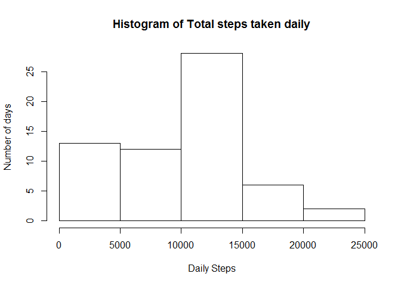
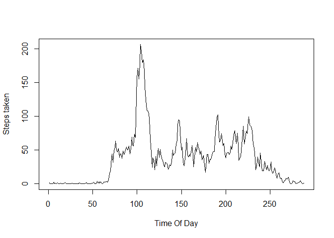

# Reproducible Research: Peer Assessment 1


## Loading and preprocessing the data


## What is mean total number of steps taken per day?


## What is the average daily activity pattern?

---
title: "fitness_activity_monitioring"
author: "Anusha Iyengar"
date: "Saturday, July 18, 2015"
output: html_document
---
Following in an analysis of **Daily fitness activity** data recorded over a period of a few days. 

The dataset consists of 3 columns, **Steps**, **date** and **interval**. 

**Steps** is the total steps taken on a given date in an **interval** of 5 minutes

```r
activeDataDf <- read.csv("activity.csv", stringsAsFactors= FALSE)
```

The activity.csv Dataset contains NULL values for Steps taken during intervals each day. 
The following analysis is done by ignoring the NULL values. 

#1. What is the mean total number of steps taken each day? 

**Histogram** of total steps taken each day. The **historgram** plots *Total Daily Steps* against *Number of days**. 


```r
totDailySteps.withNA <- tapply(activeDataDf$step, activeDataDf$date, sum, na.rm=TRUE)
library("graphics")
 hist(totDailySteps.withNA, main = "Histogram of Total steps taken daily", xlab = "Daily Steps", ylab = "Number of days")
```

 

#2. What is the average daily pattern activity

1.Make a time series plot (i.e. type = "l") of the 5-minute interval (x-axis) and the average number of steps taken, averaged across all days (y-axis)


```r
library("dplyr")
```

```
## 
## Attaching package: 'dplyr'
## 
## The following object is masked from 'package:stats':
## 
##     filter
## 
## The following objects are masked from 'package:base':
## 
##     intersect, setdiff, setequal, union
```

```r
 stepsByInt <- summarize(group_by(activeDataDf, interval), mean(steps, na.rm=TRUE))

colnames(stepsByInt)[2] <- "steps"


myts <- ts(stepsByInt$steps)
plot(myts, xlab = "Time Of Day" , ylab = "Steps taken")
```

 

Based on the above time series plot, 5 min intervals between 10.00 am and 11.00 am seems to have the most steps recorded.

#3 Imputing missing values

